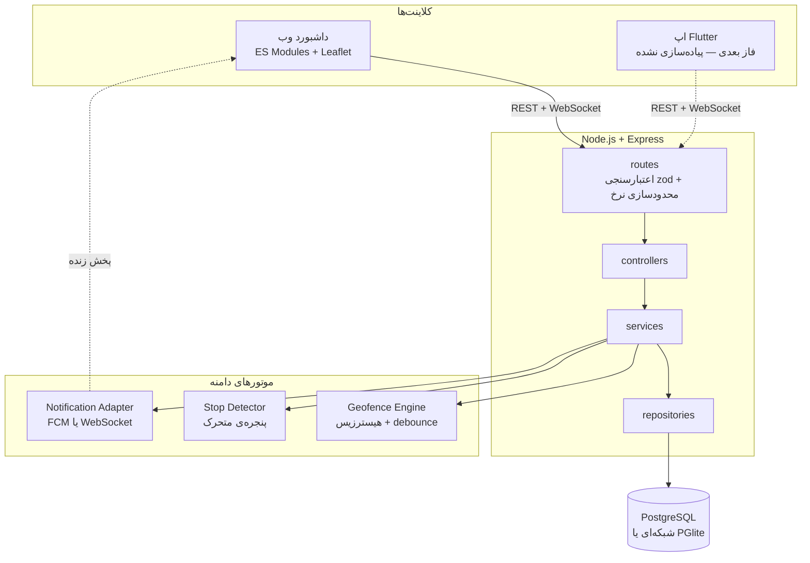
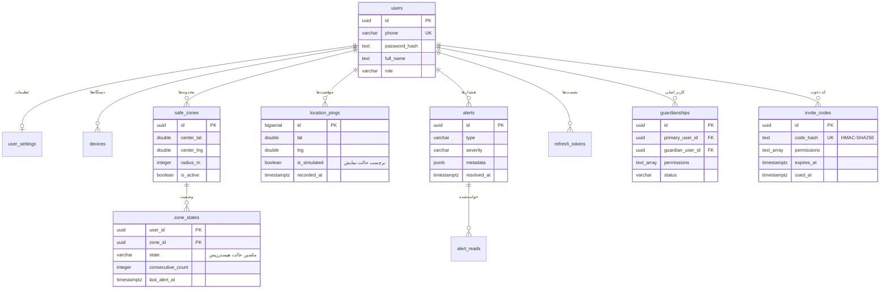
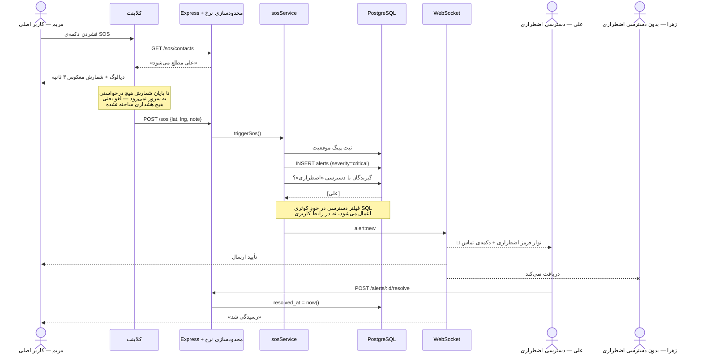
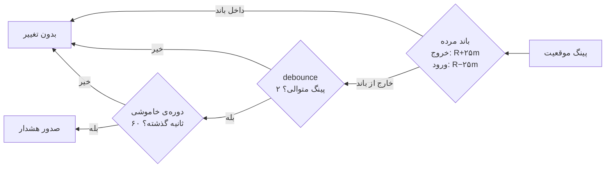

<div align="right">

# هم‌قدم — SafeStep

**سامانه‌ی ایمنی و ردیابی برای افراد دارای محدودیت حرکتی و خانواده‌هایشان**

[](#تستها)
[](https://nodejs.org)
[](https://postgresql.org)
[](#محدودیتهای-نسخهی-دمو)

</div>

---

<div align="right">

کاربر نهایی می‌خواهد **مستقل** بیرون برود. خانواده‌اش می‌خواهند **نگران نباشند**.
این دو خواسته با هم در تنش‌اند، و کل طراحی این سامانه حول همین تنش شکل گرفته است:
کاربر همیشه می‌بیند چه کسی او را می‌بیند و با یک لمس می‌تواند قطعش کند — و در همان
حال، خانواده در لحظات بحرانی فوراً مطلع می‌شود.

</div>

---

<div align="right">

## اجرا در یک دقیقه

### روش ۱ — بدون هیچ پیش‌نیازی (پیشنهادی)

</div>

```bash
cd backend
npm install
npm run seed
npm start
```

<div align="right">

سپس **http://localhost:4000** را باز کنید.

در این حالت دیتابیس روی درایور **PGlite** بالا می‌آید: همان PostgreSQL که به
WebAssembly کامپایل شده و درون همان پردازه‌ی Node اجرا می‌شود. نه Docker لازم
است، نه نصب PostgreSQL. دقیقاً همان SQL و همان مهاجرت‌ها اجرا می‌شوند.

### روش ۲ — با Docker

</div>

```bash
docker compose up
```

<div align="right">

PostgreSQL واقعی بالا می‌آید، مهاجرت‌ها و داده‌ی نمونه خودکار اجرا می‌شوند.

### حساب‌های آماده

روی صفحه‌ی ورود با یک کلیک پر می‌شوند. رمز همه: `Test@1234`

| شماره | نام | نقش |
|---|---|---|
| `09121110001` | مریم رضایی | کاربر اصلی |
| `09121110002` | علی رضایی | عضو خانواده — دسترسی کامل شامل اضطراری |
| `09121110003` | زهرا رضایی | عضو خانواده — بدون دسترسی اضطراری |

> برای دیدن همزمانی زنده، پنجره‌ی دوم را **ناشناس (incognito)** باز کنید،
> وگرنه هر دو یک نشست مشترک می‌گیرند.

سناریوی گام‌به‌گام سه دقیقه‌ای: [`docs/demo-script.md`](docs/demo-script.md)

</div>

---

<div align="right">

## قابلیت‌ها

### کاربر اصلی
- کارت وضعیت سه‌حالته: داخل محدوده / خارج / نامشخص — با متن صریح کنار رنگ
- دکمه‌ی SOS دایره‌ای بزرگ با شمارش معکوس ۳ ثانیه‌ای قابل لغو
- بنر همیشگی «چه کسانی موقعیت شما را می‌بینند» با دکمه‌ی قطع فوری
- ساخت محدوده‌ی امن با لمس روی نقشه و اسلایدر شعاع با پیش‌نمایش زنده
- مدیریت اعضای خانواده و سطح دسترسی هر کدام
- تاریخچه‌ی مسیر با امکان حذف واقعی داده

### عضو خانواده
- نقشه‌ی زنده با موقعیت لحظه‌ای فرد تحت مراقبت
- تایم‌لاین هشدارها با فیلتر بر اساس نوع و وضعیت خواندن
- نوار قرمز اضطراری با دکمه‌ی تماس هنگام دریافت SOS
- تاریخچه‌ی مسیر با انتخاب روز

### موتور
- **Geofencing** با فرمول Haversine، هیسترزیس و debounce
- **تشخیص توقف طولانی** با پنجره‌ی متحرک و شعاع پراکندگی
- **تشخیص قطع GPS** و هشدار باتری کم
- **پخش زنده** با WebSocket — تأخیر زیر یک ثانیه

</div>

---

<div align="right">

## معماری

</div>



<div align="right">

**چرا این لایه‌بندی:** لایه‌ی سرویس هیچ وابستگی‌ای به Express یا socket.io ندارد.
نتیجه این است که موتور Geofence و تشخیص توقف بدون بالا آوردن سرور و بدون هیچ
mock ای قابل تست‌اند — و همین است که ۵۷ تست واحد را ممکن کرده است.

</div>

---

<div align="right">

## مدل داده

</div>



<div align="right">

دو تصمیم که ارزش توضیح دارند:

**`is_simulated` روی هر پینگ** — صداقتِ «حالت نمایش» تا سطح دیتابیس. هر نقطه‌ای
که شبیه‌ساز تولید کرده، برای همیشه قابل تشخیص است و در رابط کاربری برچسب می‌خورد.

**جدول `zone_states`** — هیسترزیس بدون حالت ماندگار معنا ندارد: تصمیم درباره‌ی
«خروج» به وضعیت قبلی نیاز دارد، نه فقط به فاصله‌ی فعلی.

</div>

---

<div align="right">

## نمودار توالی — سناریوی SOS

</div>



---

<div align="right">

## نکته‌ی مهندسی: چرا هیسترزیس

اگر ساده بگوییم «فاصله بیشتر از شعاع یعنی خارج»، کاربری که روی مرز محدوده
بایستد با هر نوسان معمول GPS (۱۰ تا ۳۰ متر در محیط شهری) یک بار خارج و یک بار
داخل تشخیص داده می‌شود. نتیجه: ده‌ها هشدار در چند دقیقه، و خانواده‌ای که بعد از
بار پنجم دیگر هیچ هشداری را جدی نمی‌گیرد.

**سنجش واقعی روی ۲۰ پینگ نوسانی دقیقاً روی مرز:**

| روش | تعداد هشدار |
|---|---|
| مقایسه‌ی ساده‌ی `فاصله > شعاع` | **۱۹** |
| موتور این پروژه | **۰** |

و در همان حال، یک خروج واقعی همچنان **دقیقاً یک** هشدار تولید می‌کند.

این عدد ادعا نیست — یک تست اجراشونده است:
[`backend/tests/geofence.test.js`](backend/tests/geofence.test.js)

سه لایه‌ی دفاعی مستقل:

</div>



---

<div align="right">

## فهرست API

پایه: `/api/v1`

### احراز هویت

| متد | مسیر | توضیح |
|---|---|---|
| `POST` | `/auth/register` | ثبت‌نام با شماره موبایل |
| `POST` | `/auth/login` | ورود |
| `POST` | `/auth/refresh` | تازه‌سازی توکن (با چرخش) |
| `POST` | `/auth/logout` | خروج |
| `GET` | `/auth/me` | پروفایل و تنظیمات |

### سرپرستی و کد دعوت

| متد | مسیر | توضیح |
|---|---|---|
| `POST` | `/guardianships/invites` | ساخت کد دعوت ۶ رقمی |
| `POST` | `/guardianships/redeem` | مصرف کد توسط عضو خانواده |
| `GET` | `/guardianships` | فهرست هر دو جهت رابطه |
| `PATCH` | `/guardianships/:id` | تغییر سطح دسترسی |
| `DELETE` | `/guardianships/:id` | قطع دسترسی |

### موقعیت

| متد | مسیر | توضیح |
|---|---|---|
| `POST` | `/locations/ping` | ثبت موقعیت + اجرای موتورها |
| `GET` | `/locations/status` | وضعیت خودِ کاربر |
| `GET` | `/locations/watching` | همه‌ی افراد تحت مراقبت |
| `GET` | `/locations/current` | آخرین موقعیت یک کاربر |
| `GET` | `/locations/history` | تاریخچه‌ی مسیر |
| `DELETE` | `/locations/history` | **حذف واقعی** داده |
| `PUT` | `/locations/sharing` | روشن/خاموش کردن اشتراک |

### محدوده، هشدار و SOS

| متد | مسیر | توضیح |
|---|---|---|
| `GET` `POST` | `/safe-zones` | فهرست و ساخت محدوده |
| `POST` | `/safe-zones/preview` | پیش‌نمایش پیش از ذخیره |
| `PATCH` `DELETE` | `/safe-zones/:id` | ویرایش و حذف |
| `GET` | `/alerts` | فهرست با فیلتر نوع و نخوانده |
| `POST` | `/alerts/:id/read` | علامت خوانده‌شده |
| `POST` | `/alerts/:id/resolve` | بستن هشدار |
| `POST` | `/sos` | 🔴 هشدار اضطراری (محدودشده) |
| `GET` | `/sos/contacts` | مخاطبان اضطراری |

### تنظیمات و حالت نمایش

| متد | مسیر | توضیح |
|---|---|---|
| `GET` `PATCH` | `/settings` | تنظیمات کاربر |
| `POST` | `/devices` | ثبت توکن Push |
| `GET` | `/simulator/routes` | مسیرهای شبیه‌سازی |
| `POST` | `/simulator/start` `/stop` | کنترل شبیه‌ساز |
| `GET` | `/health` | سلامت سرویس |

**رویدادهای WebSocket:**
`location:update` · `alert:new` · `sharing:changed` · `zone:state` · `simulator:status`

</div>

---

<div align="right">

## امنیت و مدل تهدید

### چه کسی چه چیزی را می‌بیند

| نقش | موقعیت زنده | هشدار عادی | هشدار SOS | تاریخچه | حذف داده |
|---|:---:|:---:|:---:|:---:|:---:|
| کاربر اصلی | ✅ | ✅ | ✅ | ✅ | ✅ |
| عضو با `view_location` | ✅ | ❌ | ❌ | ✅ | ❌ |
| عضو با `receive_alerts` | ❌ | ✅ | ❌ | ❌ | ❌ |
| عضو با `emergency` | ❌ | ✅ | ✅ | ❌ | ❌ |
| عضو با دسترسی قطع‌شده | ❌ | ❌ | ❌ | ❌ | ❌ |

این جدول **در لایه‌ی SQL اعمال می‌شود**، نه در رابط کاربری. تست یکپارچه‌ی
[`sos.integration.test.js`](backend/tests/sos.integration.test.js) اثبات می‌کند
که SOS فقط به دارنده‌ی دسترسی اضطراری می‌رسد.

### تهدیدها و پاسخ‌ها

| تهدید | پاسخ |
|---|---|
| حدس زدن رمز عبور | محدودسازی نرخ + پیام خطای یکسان برای «کاربر نیست» و «رمز غلط» |
| حدس زدن کد دعوت | یک‌بارمصرف + انقضای ۱۵ دقیقه + محدودسازی نرخ + مصرف اتمیک |
| نشت دیتابیس | کد دعوت با HMAC و کلید خارج از دیتابیس؛ پسورد با bcrypt |
| سرقت توکن تازه‌سازی | چرخش توکن؛ استفاده‌ی مجدد، همه‌ی نشست‌ها را باطل می‌کند |
| نشت موقعیت در لاگ | لاگر تمام مختصات را قبل از نوشتن حذف می‌کند |
| دسترسی پس از قطع رابطه | شرط `status = 'active'` در تمام کوئری‌ها |
| نشت غیرمستقیم موقعیت | با خاموش بودن اشتراک، حتی هشدار «خروج از خانه» هم ارسال نمی‌شود |

### تنش استقلال و ایمنی در کد

وقتی کاربر اشتراک موقعیت را قطع می‌کند:

| رفتار | نتیجه |
|---|---|
| ثبت پینگ در دیتابیس | ✅ ادامه دارد — تاریخچه‌ی کاربر مال خودِ اوست |
| پخش موقعیت به خانواده | ❌ کاملاً متوقف |
| هشدار خروج از محدوده | ❌ متوقف — چون خودش یک نشت موقعیت است |
| **دکمه‌ی اضطراری** | ✅ **همچنان کار می‌کند** — کاربر خودش آغازش کرده |

</div>

---

<div align="right">

## تست‌ها

</div>

```bash
cd backend && npm test
```

<div align="right">

| فایل | تعداد | پوشش |
|---|---|---|
| [`geo.test.js`](backend/tests/geo.test.js) | ۱۹ | Haversine، مرکز ثقل، پراکندگی، درون‌یابی |
| [`geofence.test.js`](backend/tests/geofence.test.js) | ۲۱ | هیسترزیس، debounce، جلوگیری از هشدار لرزان |
| [`stopDetector.test.js`](backend/tests/stopDetector.test.js) | ۱۷ | توقف، حرکت، شکاف داده، قطع GPS |
| [`sos.integration.test.js`](backend/tests/sos.integration.test.js) | ۲۶ | کل مسیر ثبت‌نام تا SOS، روی پشته‌ی واقعی |
| **جمع** | **۸۳** | همگی سبز |

تست یکپارچه هیچ چیزی را mock نمی‌کند: Express، JWT، PostgreSQL (نسخه‌ی
درون‌حافظه‌ای)، موتور Geofence و توزیع هشدار همگی واقعاً اجرا می‌شوند.

</div>

---

<div align="right">

## حالت نمایش — چه چیزی واقعی است

برای نمایش سیستم در یک جلسه‌ی کوتاه نمی‌توان کسی را واقعاً در خیابان راه برد.
شبیه‌ساز موقعیت این کار را می‌کند — و ما صریح می‌گوییم که شبیه‌سازی است.

| | |
|---|---|
| 🎬 **شبیه‌سازی‌شده** | فقط منبع مختصات |
| ✅ **واقعی** | ثبت در دیتابیس، موتور Geofence، تشخیص توقف، توزیع هشدار بر اساس دسترسی، پخش زنده |

پینگ‌های شبیه‌سازی‌شده از همان endpoint واقعی عبور می‌کنند و با پرچم
`is_simulated` در دیتابیس ذخیره می‌شوند. در تمام صفحات با چیپ بنفش
**«حالت نمایش»** مشخص‌اند.

**نوتیفیکیشن:** ساختار FCM کامل پیاده شده است. اگر کلید در دسترس نباشد،
آداپتور خودکار روی تحویل درون‌برنامه‌ای + WebSocket می‌افتد. برای فعال شدن
ارسال واقعی فقط کافی است `FCM_SERVER_KEY` در `.env` گذاشته شود —
**بدون هیچ تغییر کدی**. وضعیت فعلی در `/health` دیده می‌شود.

**نقشه:** OpenStreetMap، بدون نیاز به کلید API.

</div>

---

<div align="right">

## ساختار پروژه

</div>

```
.
├── backend/
│   ├── src/
│   │   ├── config/          # متغیرهای محیطی و ثابت‌های دامنه
│   │   ├── db/              # درایور دوگانه، مهاجرت‌ها، داده‌ی نمونه
│   │   ├── middleware/      # احراز هویت، اعتبارسنجی، خطا، محدودسازی نرخ
│   │   ├── routes/          # تعریف endpointها
│   │   ├── controllers/     # تبدیل درخواست به فراخوانی سرویس
│   │   ├── services/        # منطق دامنه (مستقل از فریم‌ورک)
│   │   ├── repositories/    # دسترسی به داده
│   │   ├── realtime/        # WebSocket
│   │   └── utils/           # Haversine، رمزنگاری، JWT، لاگر
│   └── tests/               # ۸۳ تست
├── web/                     # داشبورد بدون مرحله‌ی بیلد
│   ├── css/                 # توکن‌های دیزاین‌سیستم + کامپوننت‌ها
│   ├── js/views/            # نُه صفحه
│   └── vendor/              # Leaflet، socket.io، فونت Vazirmatn (محلی)
├── docs/
│   ├── progress.md          # گزارش کامل پیشرفت
│   └── demo-script.md       # سناریوی سه دقیقه‌ای
└── docker-compose.yml
```

---

<div align="right">

## محدودیت‌های نسخه‌ی دمو

این یک دموی فنی است، نه محصول آماده‌ی انتشار. صادقانه:

| مورد | وضعیت |
|---|---|
| **اپ موبایل Flutter** | نوشته نشده — این نسخه فقط بک‌اند و داشبورد وب است |
| **ارسال واقعی FCM** | ساختار کامل، فقط کلید لازم است (~۲ ساعت) |
| **تأیید شماره با پیامک** | ثبت‌نام بدون تأیید پیامک است |
| **ردیابی در پس‌زمینه** | نیازمند مجوزهای بومی Android/iOS |
| **بهینه‌سازی باتری** | فاصله‌ی پینگ فعلاً ثابت است |
| **PostGIS** | فعلاً Haversine در سطح سرویس |
| **پنل مدیریت** | پیاده نشده |
| **زبان انگلیسی** | ساختار آماده، ترجمه نوشته نشده |
| **تست بار** | انجام نشده |

نقشه‌ی راه کامل با تخمین زمان: [`docs/progress.md`](docs/progress.md)

### دو نکته‌ی فنی

- کاشی‌های نقشه به اینترنت نیاز دارند. بقیه‌ی سیستم کاملاً آفلاین کار می‌کند.
- رازهای داخل `.env.example` فقط برای اجرای محلی‌اند. در محیط واقعی حتماً
  مقادیر تصادفی بگذارید:
  ```bash
  node -e "console.log(require('crypto').randomBytes(48).toString('hex'))"
  ```

</div>
